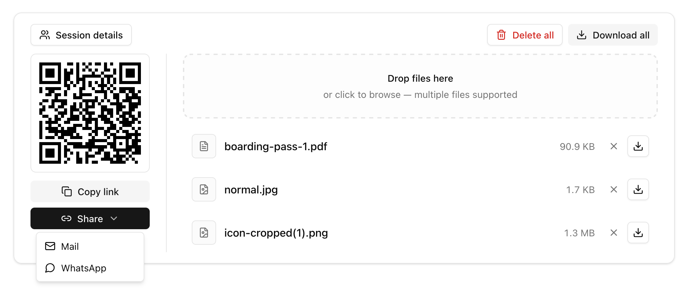

<div>
<h3>dropafile</h3>
<p>
<strong>Drop a file. Everyone gets it live.</strong> Ephemeral, live-session file sharing on <strong>Cloudflare Workers</strong> — spin up a room, share a link or QR code, and let connected peers download in real time. No accounts, no persistent storage.
</p>
<a href="https://dropafile.app-org-es.workers.dev/"></a>
</div>

<br/><br/>

<div align="center">

[](https://github.com/dropafile/dropafile/actions/workflows/deploy.yml)
[](https://github.com/dropafile/dropafile/blob/main/LICENSE)
[](https://workers.cloudflare.com/)
[](https://github.com/dropafile/dropafile)
[](https://github.com/dropafile/dropafile)

<br/>
<br/>

<br/>

**No accounts · No cloud storage · Peer-to-peer while online**

</div>

<hr>

## How it works

Three steps from drop to download — built around **live sessions**, not static upload links.

| Step | | What happens |
|:--:|:--|:--|
| **1** | **Drop a file** | Drag and drop or browse. A live session spins up the moment your file is ready — or **Start live session** first, then upload. |
| **2** | **Share the session** | Send a **QR code** or **link**. Anyone on the page joins the same room instantly — or **Join session** with a pasted link or code. |
| **3** | **Download while live** | Peers see your files in real time and download **directly from your browser** while you stay connected. **Leave** when done — files are removed and the room closes. |

## Built for

When you need files in front of people **right now** — not buried in inboxes or waiting on sync folders.

| | |
|:--|:--|
| **Meeting handoffs** | Swap decks, screenshots, or exports with everyone in the room without email threads. |
| **Quick cross-device sends** | Move a file from laptop to phone by opening the same session link on both devices. |
| **Client deliverables** | Share a temporary link for a review package. Remove files when the handoff is done. |
| **Ephemeral by design** | No accounts, no permanent cloud storage. Files disappear when owners leave or remove them. |

## Features

| Feature | Description |
|---------|-------------|
| **QR + link share** | Copy the session URL, scan a QR code, or share via mail / messaging shortcuts. |
| **Multi-file queue** | Drop several files at once; uploads run sequentially with progress feedback. |
| **Live file catalog** | Real-time `file-added`, `file-removed`, and sync over WebSocket. |
| **Peer-to-peer download** | File bytes flow browser-to-browser while owners stay connected. |
| **Session details** | See connected peers, host badge, share URL, and per-user file counts. |
| **Bulk actions** | **Download all** shared files or **Delete all** of your own in one click. |
| **Same-tab recovery** | Reload without losing your catalog — owned blobs recover from `sessionStorage`. |
| **Supported types** | PNG, JPEG, plain text, JSON, PDF, ZIP |

## Under the hood

Open source on [**Cloudflare Workers**](https://workers.cloudflare.com/) — one repo, one deploy.

| Layer | Tech |
|-------|------|
| **Edge API** | Hono · Durable Object session rooms · WebSocket signaling |
| **Web app** | React SPA · live session UI · drag-and-drop dropzone |
| **Transfer model** | Signaling on the worker; file bytes peer-to-peer in the browser |

## Quick start

```bash
git clone https://github.com/dropafile/dropafile.git
cd dropafile
npm install
npm run dev
```

Health check:

```bash
curl http://localhost:5173/health
```

Deploy:

```bash
npm run deploy              # default worker
npm run deploy:staging      # ENVIRONMENT=staging
npm run deploy:production   # ENVIRONMENT=production
```

Copy `.dev.vars.example` to `.dev.vars` for local development.

## API

| Surface | Route / area | Description |
|---------|----------------|-------------|
| API | `GET /health` | Liveness check |
| API | `POST /api/sessions` | Create a live room |
| API | `GET /api/sessions/:id` | Session status |
| API | `GET /api/sessions/:id/ws` | WebSocket room (Durable Object) |
| API | `POST /api/upload` | File classification + metadata |
| App | Landing page | Hero, dropzone, start/join session |
| App | Session panel | QR + link share, multi-file queue, file list |
| App | Session details | Connected peers, host badge, share URL |
| App | `SessionProvider` | Session state, `sessionStorage` catalog for same-tab reload |

## Environment variables

| Variable | Required | Purpose |
|----------|----------|---------|
| `ENVIRONMENT` | No | `development` (local via `.dev.vars`), `staging`, or `production` (set in `wrangler.toml` env sections) |
| `ALLOWED_ORIGINS` | No | Comma-separated CORS origins |

## Project layout

```text
src/
├── api-server/     # Hono Worker, SessionRoom Durable Object
├── app/            # React SPA (SessionProvider, landing, session UI)
├── types/          # Shared contracts
└── utils/          # Classification, formatting
```

## Documentation

| Doc | Description |
|-----|-------------|
| [`index.md`](index.md) | OKF bundle — architecture and extension notes |
| [`INSTRUCTIONS.md`](INSTRUCTIONS.md) | Maintainer and development guide |
| [`CHANGELOG.md`](CHANGELOG.md) | Release history |
| [`.agents/skills/`](.agents/skills/) | Cursor agent skills catalog |

Org: [@dropafile](https://github.com/dropafile) · Maintained by [Charlie Rios (@xarlizard)](https://github.com/xarlizard)

## Contributing

Contributions are welcome. Please read [CONTRIBUTING.md](CONTRIBUTING.md) before opening a pull request.

## Security

To report a vulnerability, see [SECURITY.md](SECURITY.md).

## License

dropafile is released under the [MIT License](LICENSE).

---

## Repository documents

**README** | [INSTRUCTIONS](INSTRUCTIONS.md) | [CHANGELOG](CHANGELOG.md) | [CONTRIBUTING](CONTRIBUTING.md) | [SECURITY](SECURITY.md) | [CODE_OF_CONDUCT](CODE_OF_CONDUCT.md)
